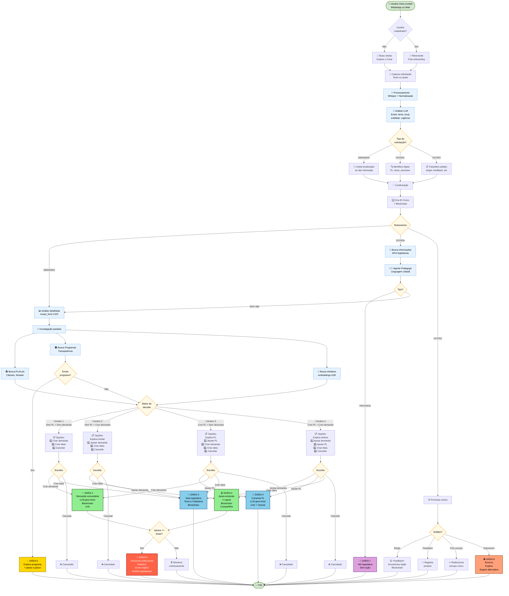

# Fluxos do Projeto Coral

Este documento detalha os fluxos de interação do usuário com a plataforma Coral, descrevendo cada etapa, decisões do sistema e pontos de transição entre diferentes estados.

---

## 1. Fluxo de Onboarding

O **fluxo de onboarding** é o primeiro contato do cidadão com a plataforma Coral. Este é um momento crítico onde precisamos estabelecer confiança, entender a necessidade do usuário e coletar informações mínimas para personalizar a experiência.

### 1.1. Canais de Entrada

O cidadão pode iniciar o contato através de dois canais principais:

#### 1.1.1. WhatsApp
- **Trigger:** Cidadão envia mensagem para o número oficial do Coral
- **Formato:** Texto ou áudio
- **Vantagem:** Canal onde o brasileiro já está, zero fricção

#### 1.1.2. Bot do Site
- **Trigger:** Cidadão acessa o site do Coral e inicia conversa no chat
- **Formato:** Texto (com possibilidade de áudio em versões futuras)
- **Vantagem:** Acesso via web para quem prefere interface desktop/tablet

---

### 1.2. Primeira Interação (Boas-vindas)

Quando o cidadão envia a primeira mensagem, o sistema:

#### 1.2.1. Detecção de Novo Usuário
```
Sistema verifica:
- Número de telefone/ID do usuário existe no banco?
  - SIM → Usuário retornando (pula para fluxo de retorno)
  - NÃO → Novo usuário (continua onboarding)
```

#### 1.2.2. Mensagem de Boas-vindas
O bot responde com uma mensagem acolhedora e explicativa:

**Exemplo de mensagem:**
```
Olá! 👋 Bem-vindo(a) ao Coral!

Eu sou seu assistente cívico e estou aqui para te ajudar a:
✅ Entender leis e projetos que afetam sua vida
✅ Reportar problemas do seu bairro ou cidade
✅ Acompanhar o que acontece com suas demandas
✅ Fazer sua voz chegar onde precisa

Pode me falar por texto ou áudio, como preferir!

Para começar, me conta: o que te trouxe aqui hoje?
```

**Objetivos desta mensagem:**
- Criar conexão emocional (tom acolhedor)
- Explicar o valor da plataforma de forma clara e concisa
- Estabelecer expectativas (pode usar texto ou áudio)
- Fazer pergunta aberta para entender a necessidade

---

### 1.3. Captura e Processamento da Solicitação Inicial

O usuário responde com sua solicitação. Neste momento, o sistema:

#### 1.3.1. Processamento da Entrada
```
1. Se ÁUDIO:
   - Transcrever usando Whisper
   - Normalizar texto
   
2. Se TEXTO:
   - Normalizar texto (correção ortográfica leve, remoção de ruídos)

3. Análise inicial com LLM:
   - Identificar tipo de solicitação (demanda, dúvida, outro)
   - Extrair tema preliminar (saúde, transporte, educação, segurança, etc.)
   - Detectar menções de localização (bairro, rua, região)
   - Identificar urgência/gravidade
   - Extrair entidades afetadas (linha de ônibus, escola, UBS, etc.)
```

---

### 1.4. Classificação da Solicitação

O sistema classifica a solicitação em uma das três categorias:

#### 1.4.1. DEMANDA
- **Definição:** Problemas concretos que requerem ação ou resolução
- **Exemplos:**
  - "Tem um buraco enorme na Rua X"
  - "A linha de ônibus 40 está sempre atrasada"
  - "Falta médico na UBS do meu bairro"
  - "Quero propor uma ciclovia na Avenida Y"

#### 1.4.2. DÚVIDA
- **Definição:** Perguntas sobre leis, projetos, processos ou direitos
- **Exemplos:**
  - "O que é o PL 1234/2024?"
  - "Como funciona a lei de acesso à informação?"
  - "Quem é meu vereador?"
  - "Existe alguma lei sobre barulho de vizinho?"

#### 1.4.3. OUTRO
- **Definição:** Solicitações que não se encaixam nas categorias anteriores
- **Exemplos:**
  - Elogios a serviços públicos
  - Pedidos de informação genérica
  - Feedback sobre a própria plataforma
  - Mensagens fora do escopo cívico

---

### 1.5. Coleta de Informações Essenciais

Dependendo do tipo de solicitação classificada, o sistema coleta informações adicionais:

#### 1.5.1. Para DEMANDAS
O sistema pergunta sobre localização se ainda não foi mencionada:

**Exemplo:**
```
Entendi! Para te conectar com outras pessoas que têm o mesmo problema e direcionar isso pra quem pode resolver, preciso saber:

📍 Onde isso está acontecendo?

Pode me mandar:
- O endereço (ex: Rua X, Bairro Y)
- Ou sua localização (se estiver no WhatsApp, pode compartilhar o pin)
- Ou só o nome do bairro/região
```

**Dados coletados:**
- Endereço ou coordenadas geográficas
- Bairro/região (para casos onde endereço exato não é necessário)

#### 1.5.2. Para DÚVIDAS
O sistema tenta identificar qual PL/lei o usuário está mencionando:

**Exemplo:**
```
Legal que você quer entender melhor sobre isso! 📚

Você está falando de algum projeto de lei específico ou quer saber se existe alguma lei sobre [TEMA]?
```

#### 1.5.3. Para OUTROS
O sistema adapta a coleta conforme o subtipo (elogio, feedback, etc.)

---

### 1.6. Confirmação de Entendimento

O bot demonstra que entendeu e valida com o usuário antes de prosseguir.

**Objetivo:**
- Validar o entendimento do sistema
- Confirmar a classificação
- Dar sensação de escuta ativa
- Permitir correções antes de criar registros

---

### 1.7. Criação do Perfil Cívico (ID Cívico)

Após coletar e confirmar as informações, o sistema cria o perfil do usuário:

#### 1.7.1. Dados Armazenados
```
{
  "user_id": "UUID gerado",
  "phone": "+5511999999999" (se WhatsApp),
  "first_contact_date": "timestamp",
  "location_primary": {
    "address": "string",
    "coordinates": [lat, lng],
    "neighborhood": "string",
    "city": "string",
    "state": "string"
  },
  "status": "onboarding_complete"
}
```

#### 1.7.2. Registro na Blockchain
```
Ação: Criar ID Cívico
Hash: SHA-256 do user_id + timestamp
Blockchain: Polygon/Base
Metadados: {
  "action": "user_created",
  "timestamp": "ISO 8601",
  "user_id_hash": "hash do user_id + salt"
}
```

**Objetivo:** Estabelecer prova de existência do usuário desde o primeiro momento

---

### 1.8. Transição para Processamento

Após criar o perfil, o sistema informa o próximo passo:

**Exemplo:**
```
Agora vou analisar o que você me contou e vou verificar se outras pessoas já reportaram algo parecido.

Me dá só uns segundinhos... 🔍
```

**O sistema então direciona para:**
- **DEMANDA** → Seção 2 (Fluxo de Processamento de Demandas)
- **DÚVIDA** → Seção 3 (Fluxo de Processamento de Dúvidas)
- **OUTRO** → Seção 4 (Fluxo de Processamento de Outros)

---

### 1.9. Variações e Casos Especiais

#### 1.9.1. Usuário Envia Apenas "Oi" ou Saudação
```
Sistema responde:
"Oi! 👋 Tudo bem? Eu sou o Coral, seu assistente cívico.
Como posso te ajudar hoje?"
```

#### 1.9.2. Usuário Envia Mensagem Confusa ou Muito Vaga
```
Sistema responde:
"Desculpa, não entendi muito bem 😅
Você pode me explicar de novo? Pode ser por áudio também, se preferir!"
```

#### 1.9.3. Usuário Abandona no Meio do Onboarding
```
Sistema:
- Aguarda 24 horas
- Envia mensagem de reengajamento:
  "Oi! Vi que você começou a falar comigo mas não terminamos.
   Ainda quer ajuda com [TEMA]? Estou aqui! 😊"
```

#### 1.9.4. Usuário Quer Sair/Cancelar
```
Usuário: "Não quero mais" / "Cancelar" / "Sair"

Sistema responde:
"Sem problemas! Se mudar de ideia, é só me chamar.
Você pode voltar quando quiser! 👋"

Sistema: Marca status como "onboarding_cancelled"
```

---

## 2. Fluxo de Processamento de DEMANDAS

Após o onboarding, quando a solicitação foi classificada como **DEMANDA**, o sistema entra neste fluxo.

### 2.1. Análise Detalhada da Demanda

O sistema executa análise aprofundada:

```
Análise com LLM (Agente Classificador):

1. Recuperar entidades já extraídas:
   - Tema principal (saúde, transporte, educação, segurança, meio ambiente, etc.)
   - Localização (endereço, bairro, região, cidade)
   - Entidade afetada (linha de ônibus, escola, UBS, rua específica)
   - Palavras-chave relevantes

2. Determinar scope_level (Modelo da Cebola):
   - Nível 1: Hiper-local (problema físico pontual, raio ~1km)
   - Nível 2: Serviço/Região (afeta múltiplos bairros, serviço específico)
   - Nível 3: Cidade/Estado (tema macro, política pública)

3. Avaliar urgência/gravidade:
   - CRÍTICA: Risco à vida, violação de direitos fundamentais
   - ALTA: Problema persistente, afeta muitas pessoas
   - MÉDIA: Problema localizado, sem risco imediato
   - BAIXA: Sugestão de melhoria

Output:
{
  "request_type": "demanda",
  "theme": "string",
  "location": {
    "raw_text": "string",
    "coordinates": [lat, lng] | null,
    "neighborhood": "string" | null,
    "city": "string",
    "state": "string"
  },
  "affected_entity": "string" | null,
  "scope_level": 1 | 2 | 3,
  "urgency": "critica" | "alta" | "media" | "baixa",
  "keywords": ["array", "de", "palavras-chave"]
}
```

---

### 2.2. Investigação em Paralelo

O sistema executa duas investigações simultâneas:

#### 2.2.1. Busca de PLs/Leis/Programas Relacionados

```
Consultas paralelas:

1. Busca de PLs/Leis relacionadas:
   - API Câmara dos Deputados (/proposicoes)
   - API Senado/LexML
   - Portais legislativos municipais (quando disponível)
   
2. Busca de programas/ações governamentais:
   - Portal da Transparência (contratos, despesas)
   - Querido Diário (atos municipais, licitações)
   - Dados de orçamento (Tesouro Transparente)

3. Identificação de responsáveis:
   - Dados TSE (representantes da região)
   - Estrutura administrativa (secretarias, subprefeituras)

Resultado:
- existe_pl: true/false
- pls_relacionados: [lista de PLs]
- programas_existentes: [lista de programas]
- responsaveis: [lista de órgãos/secretarias]
```

#### 2.2.2. Busca de Demandas Comunitárias Similares

```
Busca por similaridade:

Critérios de matching:
1. Mesmo scope_level
2. Mesmo tema principal
3. Localização próxima (para Nível 1) OU mesma entidade (para Nível 2) OU mesmo tema macro (para Nível 3)
4. Similaridade semântica do texto (embeddings + threshold de 0.80+)

Algoritmo:
- Gera embedding do relato atual
- Compara com embeddings de demandas comunitárias ativas
- Filtra por scope_level e localização/entidade
- Ordena por score de similaridade

Resultado:
- existe_demanda_similar: true/false
- demanda_similar: {objeto da demanda} | null
- score_similaridade: 0.0 a 1.0
```

---

### 2.3. Matriz de Decisão (4 Cenários Possíveis)

Com base nos resultados das investigações, o sistema identifica um dos 4 cenários:

```
CENÁRIO 1: NÃO existe PL + NÃO existe demanda similar
CENÁRIO 2: NÃO existe PL + EXISTE demanda similar
CENÁRIO 3: EXISTE PL + NÃO existe demanda similar
CENÁRIO 4: EXISTE PL + EXISTE demanda similar
```

---

### 2.4. CENÁRIO 1: Não existe PL + Não existe demanda similar

**Contexto:** Problema novo, sem legislação relacionada e sem demanda comunitária prévia.

#### 2.4.1. Apresentação ao Usuário

```
Analisei sua solicitação e não encontrei:
❌ Projetos de lei relacionados
❌ Outras pessoas que reportaram isso aqui no Coral

Mas isso não é problema! Você pode ser o primeiro a levantar essa questão. 💪

O que você gostaria de fazer?

1️⃣ Criar demanda comunitária
   → Outras pessoas poderão apoiar e juntos vocês terão mais força

2️⃣ Criar ideia legislativa
   → Vou te ajudar a transformar isso em uma proposta de lei

3️⃣ Cancelar
```

#### 2.4.2. Opção 1: Criar Demanda Comunitária

**Fluxo:**
```
1. LLM gera texto estruturado da demanda:
   - Título (conciso e descritivo)
   - Descrição (versão estruturada do relato)
   - Tema e tags
   
2. Sistema cria demanda comunitária no banco de dados

3. Registro na blockchain:
   {
     "action": "community_demand_created",
     "demand_id_hash": "hash",
     "scope_level": 1 | 2 | 3,
     "theme": "string",
     "timestamp": "ISO 8601"
   }

4. Usuário recebe link da demanda
```

**Mensagem ao usuário:**
```
Demanda criada! ✅

📌 [Título da Demanda]
📍 [Localização]
🏷️ Tema: [Tema]

Você é o primeiro a reportar isso aqui no Coral!

Link da sua demanda: [URL]

Compartilhe com outras pessoas que possam ter o mesmo problema para fortalecer a causa! 💪
```

**Saída do sistema:** **SAÍDA #1 - Registrar demanda comunitária**

#### 2.4.3. Opção 2: Criar Ideia Legislativa

**Fluxo:**
```
1. LLM gera texto pré-formatado para ideia legislativa:
   - Título da proposta
   - Justificativa (problema identificado)
   - Proposta de solução
   - Texto em formato adequado para e-Cidadania

2. Sistema registra na blockchain:
   {
     "action": "legislative_idea_generated",
     "idea_hash": "hash do texto",
     "user_id_hash": "hash",
     "timestamp": "ISO 8601"
   }

3. Sistema gera passo a passo para cadastro no e-Cidadania
```

**Mensagem ao usuário:**
```
Ideia legislativa pronta! 📝

Preparei um texto formatado para você registrar no e-Cidadania (portal do Senado):

[TEXTO GERADO PELA LLM]

📋 Passo a passo para registrar:

1. Acesse: https://www12.senado.leg.br/ecidadania
2. Faça login com gov.br
3. Clique em "Ideia Legislativa"
4. Cole o texto que preparei
5. Envie!

Quando sua ideia atingir 20.000 apoios, ela vira uma Sugestão Legislativa oficial! 🎯

Quer que eu te ajude com mais alguma coisa?
```

**Saída do sistema:** **SAÍDA #3 - Criar uma Ideia Legislativa**

#### 2.4.4. Opção 3: Cancelar

```
Sistema responde:
"Sem problemas! Se mudar de ideia, é só me chamar novamente. 👋"

Sistema: Registra interação como "cancelled"
```

---

### 2.5. CENÁRIO 2: Não existe PL + Existe demanda similar

**Contexto:** Não há legislação relacionada, mas já existe uma demanda comunitária similar.

#### 2.5.1. Apresentação ao Usuário

```
Encontrei algo importante! 🔍

Não há projetos de lei sobre isso ainda, MAS outras [X] pessoas já reportaram um problema parecido aqui no Coral:

📌 [Título da Demanda Similar]
📍 [Localização/Entidade]
👥 [Número de apoiadores]
📅 Aberto há [tempo]

[Breve explicação do tema da demanda]

O que você gostaria de fazer?

1️⃣ Apoiar a demanda existente
   → Sua voz se junta com a delas e fica mais forte!

2️⃣ Criar ideia legislativa
   → Vou te ajudar a transformar isso em uma proposta de lei

3️⃣ Cancelar
```

#### 2.5.2. Opção 1: Apoiar a Demanda Existente

**Fluxo:**
```
1. Sistema adiciona usuário como apoiador

2. Incrementa contador de apoios (+1)

3. Registra na blockchain:
   {
     "action": "community_demand_support",
     "demand_id_hash": "hash",
     "user_id_hash": "hash",
     "timestamp": "ISO 8601"
   }

4. IA atualiza prioridade do tema no escopo
```

**Mensagem ao usuário:**
```
Pronto! ✅ Você agora está apoiando essa demanda junto com outras [X] pessoas.

Vou te manter atualizado sobre qualquer novidade!

💡 Dica: Compartilhe com outras pessoas para fortalecer ainda mais!

Link para compartilhar: [URL]

[Botão: Compartilhar no WhatsApp]
```

**Saída do sistema:** **SAÍDA #2 - Apoiar demanda comunitária já existente**

#### 2.5.3. Opção 2: Criar Ideia Legislativa

Segue o mesmo fluxo do Cenário 1, Opção 2.

**Saída do sistema:** **SAÍDA #3 - Criar uma Ideia Legislativa**

---

### 2.6. CENÁRIO 3: Existe PL + Não existe demanda similar

**Contexto:** Há projetos de lei relacionados ao tema, mas nenhuma demanda comunitária similar.

#### 2.6.1. Análise do PL pela LLM

```
LLM analisa:
1. O PL resolve o problema do usuário?
   - SIM: PL é solução adequada
   - NÃO: PL é insuficiente ou trata de aspecto diferente

2. Gera explicação em linguagem cidadã:
   - Resumo do PL
   - Antes e Depois
   - Impacto prático
   - Status de tramitação
```

#### 2.6.2. Apresentação ao Usuário (quando PL resolve)

```
Boa notícia! 📚

Encontrei um projeto de lei que trata exatamente disso:

[EXPLICAÇÃO DO PL EM LINGUAGEM CIDADÃ]

📍 Fase atual: [comissão/plenário]
📅 Última movimentação: [data]
👤 Autor: [nome]

O que você gostaria de fazer?

1️⃣ Apoiar / comentar no PL
   → Vou te ajudar a comentar oficialmente

2️⃣ Criar demanda comunitária separada
   → Para monitorar o problema localmente enquanto o PL tramita

3️⃣ Cancelar
```

#### 2.6.3. Apresentação ao Usuário (quando PL NÃO resolve)

```
Encontrei um projeto de lei relacionado, mas ele não resolve completamente o seu problema:

[EXPLICAÇÃO DO PL EM LINGUAGEM CIDADÃ]

[EXPLICAÇÃO DO QUE ESTÁ FALTANDO]

O que você gostaria de fazer?

1️⃣ Criar ideia legislativa
   → Para propor uma solução mais adequada

2️⃣ Criar demanda comunitária separada
   → Para monitorar o problema localmente

3️⃣ Cancelar
```

#### 2.6.4. Opção 1: Apoiar / Comentar no PL

**Fluxo:**
```
1. LLM gera sugestão de texto para comentário:
   - Contextualizado com o relato do usuário
   - Tom formal mas acessível
   - Argumentos baseados no impacto prático

2. Sistema fornece link direto para o PL

3. Sistema registra internamente que usuário interagiu:
   {
     "interaction_id": "UUID",
     "user_id": "UUID",
     "type": "pl_interaction",
     "pl_id": "string",
     "action": "support_comment",
     "timestamp": "ISO 8601"
   }
```

**Mensagem ao usuário:**
```
Preparei um texto para você comentar no projeto de lei! 📝

[TEXTO SUGERIDO PELA LLM]

📋 Como comentar:

1. Acesse o PL: [LINK DIRETO]
2. Faça login com gov.br
3. Vá em "Participação"
4. Cole o texto (ou adapte como preferir)
5. Envie!

Seu comentário ajuda os parlamentares a entenderem o impacto real da lei! 💪

Registrei que você interagiu com esse PL. Vou te avisar se houver atualizações importantes!
```

**Saída do sistema:** **SAÍDA #4 - Apoiar / Comentar em um PL existente**

#### 2.6.5. Opção 2: Criar Demanda Comunitária Separada

Segue o mesmo fluxo do Cenário 1, Opção 1.

**Saída do sistema:** **SAÍDA #1 - Registrar demanda comunitária**

#### 2.6.6. Opção 3: Criar Ideia Legislativa

Segue o mesmo fluxo do Cenário 1, Opção 2.

**Saída do sistema:** **SAÍDA #3 - Criar uma Ideia Legislativa**

---

### 2.7. CENÁRIO 4: Existe PL + Existe demanda similar

**Contexto:** Há tanto projetos de lei quanto demanda comunitária relacionados ao tema.

#### 2.7.1. Apresentação ao Usuário

```
Encontrei informações importantes sobre isso! 🔍

📚 PROJETO DE LEI RELACIONADO:
[EXPLICAÇÃO DO PL EM LINGUAGEM CIDADÃ]

📌 DEMANDA COMUNITÁRIA EXISTENTE:
Outras [X] pessoas já reportaram isso aqui no Coral:
- [Título da Demanda]
- [Número de apoiadores]
- [Tempo desde abertura]

O que você gostaria de fazer?

1️⃣ Apoiar a demanda comunitária
   → Juntar sua voz com outras [X] pessoas

2️⃣ Apoiar/comentar no PL
   → Participar oficialmente da tramitação

3️⃣ Criar ideia legislativa
   → Se você acha que o PL atual não resolve bem

4️⃣ Cancelar
```

#### 2.7.2. Opção 1: Apoiar a Demanda Comunitária

Segue o mesmo fluxo do Cenário 2, Opção 1.

**Saída do sistema:** **SAÍDA #2 - Apoiar demanda comunitária já existente**

#### 2.7.3. Opção 2: Apoiar/Comentar no PL

Segue o mesmo fluxo do Cenário 3, Opção 1.

**Saída do sistema:** **SAÍDA #4 - Apoiar / Comentar em um PL existente**

#### 2.7.4. Opção 3: Criar Ideia Legislativa

Segue o mesmo fluxo do Cenário 1, Opção 2.

**Saída do sistema:** **SAÍDA #3 - Criar uma Ideia Legislativa**

---

### 2.8. Verificação de Programa Governamental

Em qualquer cenário, se a investigação detectar que já existe um **programa governamental** que resolve o problema:

```
Sistema interrompe o fluxo normal e apresenta:

"Espera! 🎯 Descobri que o que você quer já é garantido por [lei/programa]!

[EXPLICAÇÃO DO PROGRAMA]

📋 Como acessar:
[PASSO A PASSO]

🔗 Link oficial: [URL]

📍 Locais de atendimento:
[MAPA/LISTA quando disponível]

Isso resolve o seu problema?"

SE usuário responde SIM:
  → Encerra fluxo com sucesso
  
SE usuário responde NÃO:
  → "Entendi. O programa existe mas não está funcionando na prática?"
  → Oferece criar demanda comunitária sobre "falha na implementação do programa X"
```

**Saída do sistema:** **SAÍDA #5 - Explicar um programa governamental como solução imediata**

---

### 2.9. Sistema de Denúncia Institucional Automática

Quando uma demanda comunitária atinge o limiar de apoios (configurável, ex: 20, 40, 100):

```
Trigger: demand.supporters.count >= THRESHOLD

Sistema automaticamente:

1. Gera relatório institucional:
   - Síntese da demanda
   - Número de apoiadores
   - Evidências (fotos, relatos)
   - Dados de contexto (população afetada, orçamento, etc.)
   - Linha do tempo

2. Identifica destinatários baseado em scope_level e urgência:
   - Gabinete de vereador/deputado relevante
   - Secretaria municipal/estadual
   - Ouvidoria
   - Ministério Público (se potencial ilegalidade)
   - Imprensa local (se grave e recorrente)

3. Envia relatório via:
   - E-mail oficial
   - Protocolo em sistema de ouvidoria
   - Registro em blockchain do envio

4. Notifica TODOS os apoiadores:
   "🎯 Sua demanda atingiu [X] apoios!
   
   Acabamos de enviar um relatório institucional para:
   - [Lista de destinatários]
   
   Vou te avisar quando recebermos resposta!"
```

**Saída do sistema:** **SAÍDA #6 - Envio de denúncia institucional automática**

---

## 3. Fluxo de Processamento de DÚVIDAS

Quando a solicitação foi classificada como **DÚVIDA**, o sistema entra neste fluxo.

### 3.1. Identificação do Tipo de Dúvida

```
Análise da pergunta:

Tipo de dúvida:
1. Sobre PL/lei específica (usuário menciona número/nome)
2. Sobre tema genérico ("existe lei sobre X?")
3. Sobre processo ("como funciona Y?")
4. Sobre representantes ("quem é meu vereador?")
5. Informação legislativa pura ("quem votou no PL X?")

Extração de entidades:
- ID do PL/lei (se mencionado)
- Tema da consulta
- Localização (se relevante)
```

---

### 3.2. Busca de Informações

```
Consultas baseadas no tipo:

TIPO 1 - PL/lei específica:
  - API Câmara/Senado: busca por ID ou número
  - LexML: busca de texto completo
  - Querido Diário: atos municipais relacionados
  
TIPO 2 - Tema genérico:
  - Busca semântica em base de PLs por tema
  - Busca de leis já aprovadas sobre o tema
  - Busca de programas governamentais relacionados
  
TIPO 3 - Processo:
  - Base de conhecimento interna (FAQ)
  - Documentação oficial (e-Cidadania, portais gov)
  
TIPO 4 - Representantes:
  - Dados TSE (por localização do usuário)
  - Dados de votação por seção/bairro

TIPO 5 - Informação legislativa:
  - API Câmara/Senado (votações, tramitação, etc.)
```

---

### 3.3. Resposta Educativa (Agente Pedagogo)

O sistema gera uma resposta em **linguagem cidadã**, sem jargões:

#### 3.3.1. Para PL/Lei Específica

**Estrutura da resposta:**
```
1. Resumo em uma frase
   "Esse projeto quer [objetivo principal] para [quem é afetado]"

2. Contexto (Antes e Depois)
   HOJE: [situação atual]
   SE APROVADO: [o que muda]

3. Impacto prático
   "Na prática, isso significa que [exemplo concreto na vida do cidadão]"

4. Status de tramitação
   📍 Fase atual: [comissão/plenário/etc]
   📅 Última movimentação: [data]
   👤 Autor: [nome]
```

**Exemplo de resposta:**
```
Encontrei! 📚

O PL 1234/2024 quer reduzir impostos sobre remédios para doenças crônicas.

HOJE: Cerca de 30% do preço do remédio é imposto
SE APROVADO: Esse imposto cairia para 10%

Na prática: um remédio de R$ 100 poderia custar cerca de R$ 80.

📍 O projeto está na Comissão de Finanças
📅 Última movimentação: 15/11/2024
👤 Autor: Deputado(a) [Nome]

Isso responde sua dúvida? Quer saber mais alguma coisa?
```

#### 3.3.2. Para Tema Genérico

**Exemplo (quando existe):**
```
Sim, existem algumas leis sobre isso! 📖

Encontrei 2 projetos em tramitação:

1️⃣ PL 5678/2023 - [Resumo curto]
   Status: [fase atual]
   
2️⃣ PL 9012/2024 - [Resumo curto]
   Status: [fase atual]

Quer que eu explique algum deles em detalhes?
```

**Exemplo (quando não existe):**
```
Não encontrei nenhuma lei específica sobre isso. 🤔

Mas você pode criar uma proposta! Quer que eu te ajude com isso?
```

#### 3.3.3. Para Processos

**Exemplo:**
```
Como funciona o e-Cidadania? 📚

É uma plataforma do Senado onde você pode:
✅ Sugerir ideias de lei
✅ Apoiar ideias de outras pessoas
✅ Comentar em projetos que estão tramitando

Quando uma ideia atinge 20.000 apoios, ela vira uma Sugestão Legislativa oficial!

Isso responde sua dúvida?
```

#### 3.3.4. Para Representantes

**Exemplo:**
```
Seus representantes na região de [Bairro/Cidade]: 🗳️

VEREADORES (top 3 mais votados no seu bairro):
1. [Nome] - [Partido] - [X] votos
   📧 [email] | 📱 [telefone]
   
2. [Nome] - [Partido] - [Y] votos
   📧 [email] | 📱 [telefone]
   
3. [Nome] - [Partido] - [Z] votos
   📧 [email] | 📱 [telefone]

DEPUTADO ESTADUAL: [Nome] - [Partido]
DEPUTADO FEDERAL: [Nome] - [Partido]

Quer entrar em contato com algum deles?
```

#### 3.3.5. Para Informação Legislativa Pura

**Exemplo:**
```
Usuário: "Quem votou a favor do PL 1234/2024?"

Sistema:
"Votação do PL 1234/2024 em [data]:

✅ A FAVOR: [X] votos
❌ CONTRA: [Y] votos
⚪ ABSTENÇÕES: [Z] votos

Principais partidos a favor: [lista]
Principais partidos contra: [lista]

Quer ver a lista completa de como cada deputado votou?"
```

**Saída do sistema:** **SAÍDA #7 - Oferecer somente informação legislativa (sem ação)**

---

### 3.4. Registro da Interação

```
Sistema registra:

{
  "interaction_id": "UUID",
  "user_id": "UUID",
  "type": "duvida",
  "query": "texto da pergunta",
  "query_type": "pl_especifico" | "tema_generico" | "processo" | "representante" | "info_legislativa",
  "results_found": true | false,
  "related_pls": ["IDs"],
  "timestamp": "ISO 8601"
}

Objetivo: 
- Mapear quais temas geram mais dúvidas
- Identificar lacunas de informação
- Melhorar base de conhecimento
```

---

### 3.5. Conversão de Dúvida em Demanda (Opcional)

Se durante a conversa o usuário demonstra querer agir:

```
Usuário: "Mas isso é um absurdo! Deveria ter uma lei sobre isso!"

Sistema detecta mudança de intenção:
"Percebi que você quer fazer algo sobre isso! 💪

Quer transformar isso em uma ação? Posso te ajudar!

O que você prefere?"

→ Redireciona para FLUXO DE DEMANDAS (Seção 2)
```

---

## 4. Fluxo de Processamento de OUTROS

Para solicitações que não se encaixam em demandas ou dúvidas:

### 4.1. Tipo: Elogios

```
Usuário: "Quero elogiar o atendimento da UBS do meu bairro"

Sistema:
"Que legal! 😊 É importante reconhecer quando as coisas funcionam bem!

Quer que eu registre esse elogio e encaminhe para a [Secretaria de Saúde]?

Isso ajuda a mostrar o que está dando certo e deve continuar!"

SE usuário aceita:
  - Cria registro de feedback positivo
  - Encaminha para órgão responsável
  - Registra na blockchain como "positive_feedback"
```

---

### 4.2. Tipo: Feedback sobre a Plataforma

```
Usuário: "O Coral está muito bom!" OU "Não estou conseguindo fazer X"

Sistema:
"Obrigado pelo feedback! 🙏

[Se positivo]: Fico feliz que está ajudando!
[Se negativo]: Desculpa pela dificuldade. Vou registrar isso para melhorarmos.

Tem mais alguma coisa que eu possa fazer por você?"

Registro interno para equipe de produto
```

---

### 4.3. Tipo: Fora de Escopo

```
Usuário: "Qual a previsão do tempo?" OU "Me conta uma piada"

Sistema:
"Desculpa, mas eu sou especializado em questões cívicas! 😅

Posso te ajudar com:
✅ Problemas do bairro ou cidade
✅ Dúvidas sobre leis e projetos
✅ Acompanhar demandas
✅ Entender seus direitos

Tem algo assim que eu possa fazer por você?"
```

---

### 4.4. Tipo: Solicitação Impossível/Ilegal

```
Usuário: "Quero processar meu vizinho" OU "Como posso sonegar impostos?"

Sistema detecta solicitação fora dos limites:

"Entendo sua situação, mas não posso te ajudar com isso. 😔

[EXPLICAÇÃO EDUCADA DO PORQUÊ]

Posso te sugerir:
[ALTERNATIVA LEGÍTIMA, se aplicável]

Ou posso te ajudar com outras questões cívicas. O que você prefere?"
```

**Saída do sistema:** **SAÍDA #8 - Encerrar por impossibilidade jurídica**

---

## 5. Limites da LLM (O que pode e não pode fazer)

### 5.1. A LLM PODE ✅

- ✅ Resumir leis/PLs em linguagem cidadã
- ✅ Explicar impacto prático de legislação
- ✅ Gerar texto para demanda comunitária
- ✅ Gerar texto de ideia legislativa
- ✅ Sugerir texto para comentar PL
- ✅ Explicar programas do governo
- ✅ Classificar o relato do usuário em temas
- ✅ Detectar similaridade com demandas existentes
- ✅ Dar opções do fluxo
- ✅ Responder dúvidas sobre:
  - Legislação
  - Cidadania
  - Políticas públicas
  - Funcionamento do processo legislativo

---

### 5.2. A LLM NÃO PODE ❌

- ❌ Dar aconselhamento jurídico individual ("posso processar fulano?")
- ❌ Afirmar ilegalidade sem base oficial
- ❌ Sugerir ações contra pessoas específicas
- ❌ Escrever denúncia jurídica criminal complexa
- ❌ Substituir o usuário em portais oficiais
- ❌ Prometer garantia de resposta do governo
- ❌ Seguir conversa fora do fluxo (precisa voltar ao escopo)
- ❌ Emitir opinião política partidária
- ❌ Inventar dados de políticas públicas

---

### 5.3. Tratamento de Desvios de Fluxo

Quando o usuário tenta desviar do fluxo:

```
Usuário: "Mas me conta, você acha que o prefeito é corrupto?"

Sistema:
"Não posso emitir opiniões políticas ou fazer acusações. 😅

Mas posso te ajudar a:
✅ Entender como funciona a fiscalização do poder público
✅ Saber como acessar dados de transparência
✅ Criar uma demanda se você identificou algum problema específico

O que você prefere?"

→ Redireciona para o fluxo apropriado
```

---

## 6. Resumo das 8 Saídas Possíveis

| # | Saída | Quando acontece | O que o sistema faz | O que o usuário recebe |
|---|-------|-----------------|---------------------|------------------------|
| **1** | **Registrar demanda comunitária** | Não existe PL relacionado e problema é local | Cria demanda no web app + registro blockchain | Link da demanda + opção de compartilhar |
| **2** | **Apoiar demanda comunitária** | Alguém já relatou problema similar | Incrementa apoio + atualiza prioridade | Confirmação + link para compartilhar |
| **3** | **Criar Ideia Legislativa** | Problema sistêmico que exige lei | LLM redige texto + gera passo a passo | Texto formatado + tutorial e-Cidadania |
| **4** | **Apoiar/Comentar PL** | Já existe PL que trata do tema | Gera texto de comentário + fornece link | Texto sugerido + link direto + tutorial |
| **5** | **Explicar programa governamental** | Usuário quer algo já garantido por lei/programa | Explica programa + fornece passo a passo | Informação + link oficial + mapa |
| **6** | **Denúncia institucional automática** | Demanda atinge limiar de apoios (≥X) | Gera relatório + envia para órgãos | Notificação de envio + lista destinatários |
```

---

### 3.4. Registro da Interação

```
Sistema registra:

{
  "interaction_id": "UUID",
  "user_id": "UUID",
  "type": "duvida",
  "query": "texto da pergunta",
  "query_type": "pl_especifico" | "tema_generico" | "processo" | "representante" | "info_legislativa",
  "results_found": true | false,
  "related_pls": ["IDs"],
  "timestamp": "ISO 8601"
}

Objetivo: 
- Mapear quais temas geram mais dúvidas
- Identificar lacunas de informação
- Melhorar base de conhecimento
```

---

### 3.5. Conversão de Dúvida em Demanda (Opcional)

Se durante a conversa o usuário demonstra querer agir:

```
Usuário: "Mas isso é um absurdo! Deveria ter uma lei sobre isso!"

Sistema detecta mudança de intenção:
"Percebi que você quer fazer algo sobre isso! 💪

Quer transformar isso em uma ação? Posso te ajudar!

O que você prefere?"

→ Redireciona para FLUXO DE DEMANDAS (Seção 2)
```

---

## 4. Fluxo de Processamento de OUTROS

Para solicitações que não se encaixam em demandas ou dúvidas:

### 4.1. Tipo: Elogios

```
Usuário: "Quero elogiar o atendimento da UBS do meu bairro"

Sistema:
"Que legal! 😊 É importante reconhecer quando as coisas funcionam bem!

Quer que eu registre esse elogio e encaminhe para a [Secretaria de Saúde]?

Isso ajuda a mostrar o que está dando certo e deve continuar!"

SE usuário aceita:
  - Cria registro de feedback positivo
  - Encaminha para órgão responsável
  - Registra na blockchain como "positive_feedback"
```

---

### 4.2. Tipo: Feedback sobre a Plataforma

```
Usuário: "O Coral está muito bom!" OU "Não estou conseguindo fazer X"

Sistema:
"Obrigado pelo feedback! 🙏

[Se positivo]: Fico feliz que está ajudando!
[Se negativo]: Desculpa pela dificuldade. Vou registrar isso para melhorarmos.

Tem mais alguma coisa que eu possa fazer por você?"

Registro interno para equipe de produto
```

---

### 4.3. Tipo: Fora de Escopo

```
Usuário: "Qual a previsão do tempo?" OU "Me conta uma piada"

Sistema:
"Desculpa, mas eu sou especializado em questões cívicas! 😅

Posso te ajudar com:
✅ Problemas do bairro ou cidade
✅ Dúvidas sobre leis e projetos
✅ Acompanhar demandas
✅ Entender seus direitos

Tem algo assim que eu possa fazer por você?"
```

---

### 4.4. Tipo: Solicitação Impossível/Ilegal

```
Usuário: "Quero processar meu vizinho" OU "Como posso sonegar impostos?"

Sistema detecta solicitação fora dos limites:

"Entendo sua situação, mas não posso te ajudar com isso. 😔

[EXPLICAÇÃO EDUCADA DO PORQUÊ]

Posso te sugerir:
[ALTERNATIVA LEGÍTIMA, se aplicável]

Ou posso te ajudar com outras questões cívicas. O que você prefere?"
```

**Saída do sistema:** **SAÍDA #8 - Encerrar por impossibilidade jurídica**

---

## 5. Limites da LLM (O que pode e não pode fazer)

### 5.1. A LLM PODE ✅

- ✅ Resumir leis/PLs em linguagem cidadã
- ✅ Explicar impacto prático de legislação
- ✅ Gerar texto para demanda comunitária
- ✅ Gerar texto de ideia legislativa
- ✅ Sugerir texto para comentar PL
- ✅ Explicar programas do governo
- ✅ Classificar o relato do usuário em temas
- ✅ Detectar similaridade com demandas existentes
- ✅ Dar opções do fluxo
- ✅ Responder dúvidas sobre:
  - Legislação
  - Cidadania
  - Políticas públicas
  - Funcionamento do processo legislativo

---

### 5.2. A LLM NÃO PODE ❌

- ❌ Dar aconselhamento jurídico individual ("posso processar fulano?")
- ❌ Afirmar ilegalidade sem base oficial
- ❌ Sugerir ações contra pessoas específicas
- ❌ Escrever denúncia jurídica criminal complexa
- ❌ Substituir o usuário em portais oficiais
- ❌ Prometer garantia de resposta do governo
- ❌ Seguir conversa fora do fluxo (precisa voltar ao escopo)
- ❌ Emitir opinião política partidária
- ❌ Inventar dados de políticas públicas

---

### 5.3. Tratamento de Desvios de Fluxo

Quando o usuário tenta desviar do fluxo:

```
Usuário: "Mas me conta, você acha que o prefeito é corrupto?"

Sistema:
"Não posso emitir opiniões políticas ou fazer acusações. 😅

Mas posso te ajudar a:
✅ Entender como funciona a fiscalização do poder público
✅ Saber como acessar dados de transparência
✅ Criar uma demanda se você identificou algum problema específico

O que você prefere?"

→ Redireciona para o fluxo apropriado
```

---

## 6. Resumo das 8 Saídas Possíveis

| # | Saída | Quando acontece | O que o sistema faz | O que o usuário recebe |
|---|-------|-----------------|---------------------|------------------------|
| **1** | **Registrar demanda comunitária** | Não existe PL relacionado e problema é local | Cria demanda no web app + registro blockchain | Link da demanda + opção de compartilhar |
| **2** | **Apoiar demanda comunitária** | Alguém já relatou problema similar | Incrementa apoio + atualiza prioridade | Confirmação + link para compartilhar |
| **3** | **Criar Ideia Legislativa** | Problema sistêmico que exige lei | LLM redige texto + gera passo a passo | Texto formatado + tutorial e-Cidadania |
| **4** | **Apoiar/Comentar PL** | Já existe PL que trata do tema | Gera texto de comentário + fornece link | Texto sugerido + link direto + tutorial |
| **5** | **Explicar programa governamental** | Usuário quer algo já garantido por lei/programa | Explica programa + fornece passo a passo | Informação + link oficial + mapa |
| **6** | **Denúncia institucional automática** | Demanda atinge limiar de apoios (≥X) | Gera relatório + envia para órgãos | Notificação de envio + lista destinatários |
| **7** | **Informação legislativa pura** | Pergunta meramente informativa | Responde com dados oficiais | Resposta explicada + sem ação |
| **8** | **Encerrar por impossibilidade** | Solicitação ilegal/impossível | Explica educadamente + sugere alternativa | Explicação + alternativa legítima |

---

## 7. Fluxo Visual Completo

