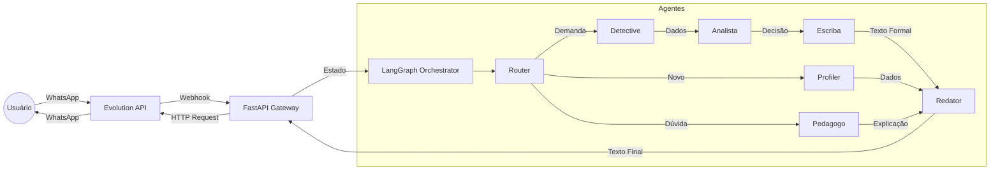

# Planejamento Técnico: Bot WhatsApp Coral

Este documento detalha a arquitetura, a estrutura de agentes e o plano de implementação para o bot de WhatsApp do projeto Coral, priorizando o uso de ferramentas gratuitas e a API do Google Gemini.

---

## 1. Arquitetura Técnica (Stack Gratuita/Low-Cost)

Para viabilizar o projeto com custo zero ou muito baixo durante a fase de piloto, utilizaremos a seguinte stack:

### 1.1. Interface (WhatsApp)
*   **Solução:** **Evolution API** (Wrapper do WhatsApp Web / Baileys).
    *   **Custo:** Gratuito (Open Source, self-hosted).
    *   **Por que:**
        *   **Zero Custo por Mensagem:** Diferente da API oficial, não há cobrança por conversa.
        *   **Liberdade:** Sem necessidade de aprovação de templates ou janelas de 24h estritas.
        *   **Facilidade:** Funciona escaneando um QR Code, como o WhatsApp Web.
    *   **Requisito:** Rodar a instância da API (via Docker) e um celular conectado.
    
### 1.2. Inteligência Artificial (LLM)
*   **Modelo:** **Google Gemini 1.5 Flash** (Principal) e **Gemini 1.5 Pro** (Para análises complexas).
    *   **Custo:** Tier gratuito disponível via Google AI Studio.
    *   **Por que:** O modelo Flash é extremamente rápido e barato (ou gratuito no tier limitado), ideal para chat em tempo real. Possui janela de contexto longa para analisar múltiplos PLs.

### 1.3. Backend & Orquestração
*   **Linguagem:** **Python** (Ecossistema forte de IA).
*   **Framework Web:** **FastAPI** (Para receber os webhooks da Evolution API).
*   **Orquestração de Agentes:** **LangGraph** (Biblioteca da LangChain).
    *   **Por que:** O fluxo do Coral é complexo, com ciclos, condicionais e estados (ex: aguardando confirmação). LangGraph é perfeito para modelar esses fluxos como um grafo de estados.
*   **Hospedagem:** **Render** (Tier Free para Web Services) ou **Vercel** (Serverless Functions).

### 1.4. Banco de Dados & Memória
*   **Plataforma:** **Postgres**.
    *   **Custo:** Tier Free generoso (500MB database).
    *   **Recursos:**
        *   **PostgreSQL:** Para dados relacionais (usuários, demandas).
        *   **pgvector:** Para busca semântica (encontrar demandas similares).
        *   **Storage:** Para salvar áudios/imagens se necessário.

---

## 2. Estrutura de Agentes (The Hive Mind)

O sistema não será um único prompt gigante, mas sim um time de agentes especializados coordenados por um grafo de estados.

### 2.1. Agente Porteiro (The Router)
*   **Função:** Recebe a mensagem bruta, transcreve (se áudio) e decide para onde vai.
*   **Input:** Texto ou Áudio.
*   **Output:** Classificação (`ONBOARDING`, `DEMANDA`, `DUVIDA`, `OUTRO`) e extração preliminar de intenção.
*   **Modelo:** Gemini 1.5 Flash (Rápido).

### 2.2. Agente Perfilador (The Profiler)
*   **Função:** Gerencia o fluxo de Onboarding.
*   **Responsabilidade:**
    *   Verificar se temos os dados mínimos (Localização, Nome implícito).
    *   Pedir informações faltantes de forma natural.
    *   Gerar o hash para o ID Cívico.
*   **Output:** Perfil de usuário validado.

### 2.3. Agente Investigador (The Detective) - *Uso de Ferramentas*
*   **Função:** Executa as buscas nas APIs externas. Este agente tem acesso a "Tools".
*   **Ferramentas:**
    *   `search_camara_api(keywords)`
    *   `search_senado_api(keywords)`
    *   `search_programs(theme)`
    *   `search_similar_demands(embedding)` (Busca vetorial no Postgres)
*   **Modelo:** Gemini 1.5 Pro (Melhor raciocínio para usar ferramentas).

### 2.4. Agente Analista (The Judge)
*   **Função:** Analisa os resultados do Investigador e aplica a Matriz de Decisão (Os 4 Cenários).
*   **Responsabilidade:**
    *   Ler os resumos dos PLs encontrados.
    *   Comparar com o relato do usuário.
    *   Decidir: "O PL resolve?", "A demanda é duplicada?".
    *   Definir quais das 8 Saídas serão ativadas.

### 2.5. Agente Escriba (The Scribe)
*   **Função:** Tradutor de "Cidadês" para "Juridiquês/Formal".
*   **Responsabilidade:**
    *   Transformar o relato informal do usuário em texto técnico.
    *   Redigir a **Ideia Legislativa** no padrão do e-Cidadania.
    *   Redigir a descrição formal da **Demanda Comunitária**.
    *   Criar sugestões de comentários formais para PLs.
*   **Output:** Texto estruturado, formal e pronto para uso oficial.

### 2.6. Agente Redator (The Voice)
*   **Função:** Gera a resposta final para o usuário em "Linguagem Cidadã".
*   **Responsabilidade:**
    *   Traduzir "juridiquês" dos PLs para português simples.
    *   Gerar textos de engajamento (mensagens de apoio).
    *   Formatar mensagens de WhatsApp (negrito, emojis).
    *   Incorporar o texto gerado pelo *Escriba* quando necessário (ex: "Aqui está o texto para você copiar: ...").
*   **Persona:** Amigável, claro, sem partidarismo.

### 2.7. Agente Pedagogo (The Teacher)
*   **Função:** Especialista em responder dúvidas (Fluxo de Dúvidas).
*   **Base de Conhecimento:** Acesso a documentos sobre processo legislativo e constituição.

---

## 3. Fluxo de Dados Simplificado



---

## 4. Plano de Implementação (Adaptado para Biblioteca)

### Fase 1: A Fundação (Evolution API)
1.  Configurar e subir **Evolution API** (usando Docker Compose localmente ou em VPS).
2.  Conectar o WhatsApp escaneando o QR Code na interface da Evolution.
3.  Criar projeto no Google AI Studio e pegar API Key do Gemini.
4.  Criar projeto no Postgres.
5.  Levantar servidor FastAPI local.
6.  Configurar Webhook na Evolution API para apontar para o FastAPI (`/webhook`).
7.  **Meta:** Bot responde "Echo: [mensagem]" usando a Evolution API.

### Fase 2: O Cérebro Básico (Router + Onboarding)
1.  Implementar o **Agente Porteiro** com Gemini.
2.  Criar tabela `users` no Postgres.
3.  Implementar fluxo de estado: Se usuário não existe → **Agente Perfilador**.
4.  **Meta:** Bot identifica usuário novo, dá boas vindas, pergunta bairro e salva no banco.

### Fase 3: A Memória (Vetores e Demandas)
1.  Habilitar `pgvector` no Postgres.
2.  Criar tabela `demands` com coluna de embedding.
3.  Implementar lógica de criar demanda.
4.  Gerar embedding do texto da demanda (Gemini Embedding).
5.  **Meta:** Usuário relata problema, bot salva demanda e gera vetor.

### Fase 4: O Investigador (Integração de APIs)
1.  Criar funções Python para consultar API da Câmara (`/proposicoes`).
2.  Implementar **Agente Investigador** que decide quais palavras-chave usar.
3.  Implementar busca de similaridade no Postgres.
4.  **Meta:** Bot consegue cruzar relato do usuário com PLs e demandas existentes.

### Fase 5: A Matriz de Decisão e Formalização
1.  Implementar a lógica dos 4 Cenários no **Agente Analista**.
2.  Implementar o **Agente Escriba** para gerar os textos formais.
3.  Refinar os prompts do **Agente Redator**.
4.  **Meta:** Fluxo completo funcionando com geração de documentos.

---

## 5. Estrutura de Pastas Sugerida

```
/src
  /agents
    router.py
    profiler.py
    detective.py
    analyst.py
    scribe.py       # Agente Escriba
    writer.py
    teacher.py
  /core
    config.py       # Chaves de API
    database.py     # Conexão Postgres
    llm.py          # Configuração Gemini
  /services
    evolution_api.py # Cliente para Evolution API (envio de msg)
    camara_api.py    # Cliente Câmara
    senado_api.py    # Cliente Senado
  /graph
    state.py        # Definição do Estado do LangGraph
    workflow.py     # Definição do Grafo
  main.py           # Entrypoint FastAPI
```

## 6. Próximos Passos Imediatos

1.  Subir container da **Evolution API**.
2.  Validar acesso à API do Gemini.
3.  Configurar ambiente Python.
4.  Iniciar Fase 1 (Conexão Evolution API + FastAPI).
